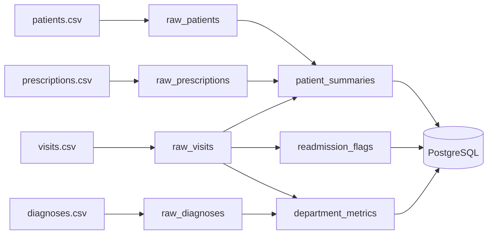

# Clinical Analytics Pipeline with Dagster

<hr>

## Overview

This project is a production-style data engineering pipeline built with Dagster.  
It processes synthetic clinical data and generates weekly analytics outputs.

The pipeline reads CSV files, loads raw data into PostgreSQL, transforms the data, and produces:

- patient summaries
- department metrics
- readmission flags

All data is synthetic (fictional). No real patient data (PHI) is used.

<hr>

## Project Context

This was a group project developed during a Data Engineering training program.

The goal was to simulate a real-world clinical analytics pipeline using:

- data ingestion
- transformation
- orchestration
- testing
- CI/CD

The project references Charité – Universitätsmedizin Berlin only as a learning context.

<hr>

## Architecture



<hr>

## Key Outputs

| Output             | Description                                       |
| ------------------ | ------------------------------------------------- |
| patient_summaries  | Patient-level analytics (visits, duration, risk)  |
| department_metrics | Department KPIs (admissions, readmission rate)    |
| readmission_flags  | Identifies patients readmitted within time window |

<hr>

## Tech Stack

| Area            | Tools        |
| --------------- | ------------ |
| Language        | Python       |
| Orchestration   | Dagster      |
| Database        | PostgreSQL   |
| Infrastructure  | Docker       |
| Testing         | Pytest       |
| Code Quality    | Ruff         |
| Version Control | Git & GitHub |

<hr>

## Project Structure

```text
.
├── clinicflow/
│   ├── src/clinicflow/defs/
│   │   ├── assets.py
│   │   ├── jobs.py
│   │   ├── resources.py
│   │   └── schedules.py
│   └── tests/
├── data/
├── docker-compose.yml
├── README.md
```

<hr>

## My Contribution

This was a group project. My contributions include:

- Working with Dagster assets and dependencies
- Supporting data transformation logic
- Debugging pipeline and tests
- Fixing CI issues (Ruff & GitHub Actions)
- Collaborating using Git

<hr>

## How to Run

```bash
docker compose up -d
cd clinicflow
uv sync
uv run pytest tests/ -v
dg dev
```

Dagster UI:  
http://localhost:3000

<hr>

## Disclaimer

This project is for educational purposes.  
All data is synthetic and fictional.  
No real patient data is used.

<hr>
