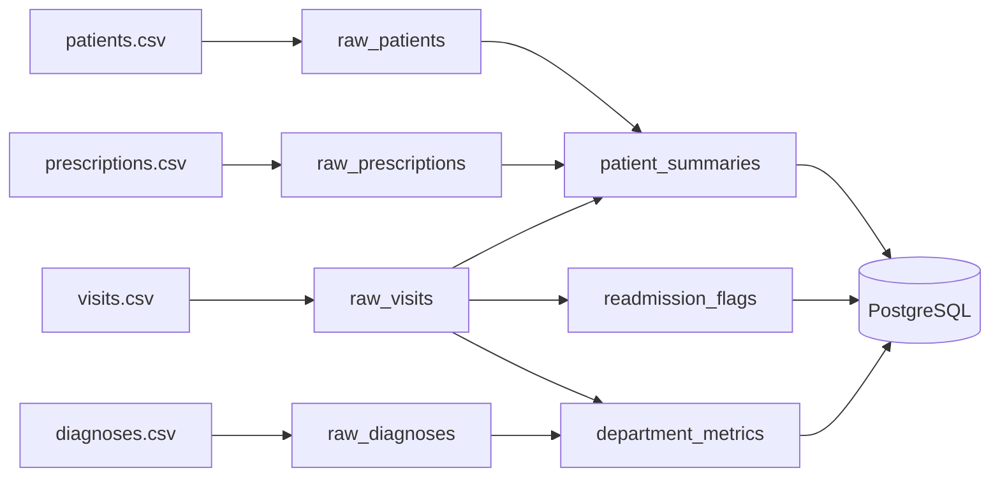

# Klinische Analyse-Pipeline mit Dagster

<hr>

## Überblick

Dieses Projekt ist eine produktionsähnliche Datenpipeline, die mit Dagster erstellt wurde.  
Sie verarbeitet synthetische klinische Daten und erstellt wöchentliche Analyseergebnisse.

Die Pipeline liest CSV-Dateien, lädt Rohdaten in PostgreSQL, transformiert die Daten und erzeugt:

- Patientenzusammenfassungen
- Abteilungskennzahlen
- Wiederaufnahme-Flags

Alle Daten sind synthetisch (fiktiv). Es werden keine echten Patientendaten (PHI) verwendet.

<hr>

## Architektur



<hr>

## Ergebnisse

| Output             | Beschreibung                                    |
| ------------------ | ----------------------------------------------- |
| patient_summaries  | Patientenanalysen (Besuche, Dauer, Risiko)      |
| department_metrics | Abteilungs-KPIs (Aufnahmen, Wiederaufnahmerate) |
| readmission_flags  | Kennzeichnet wiederaufgenommene Patienten       |

<hr>

## Technologien

| Bereich        | Tools        |
| -------------- | ------------ |
| Sprache        | Python       |
| Orchestrierung | Dagster      |
| Datenbank      | PostgreSQL   |
| Infrastruktur  | Docker       |
| Tests          | Pytest       |
| Code-Qualität  | Ruff         |
| Versionierung  | Git & GitHub |

<hr>

## Projektstruktur

```text
.
├── clinicflow/
│   ├── src/clinicflow/defs/
│   │   ├── assets.py
│   │   ├── jobs.py
│   │   ├── resources.py
│   │   └── schedules.py
│   └── tests/
├── data/
├── docker-compose.yml
├── README.md
```

<hr>

## Mein Beitrag

Dies war ein Gruppenprojekt. Meine Beiträge:

- Arbeit mit Dagster-Assets und Abhängigkeiten
- Unterstützung bei der Daten-Transformation
- Debugging von Pipeline und Tests
- Behebung von CI-Problemen (Ruff & GitHub Actions)
- Zusammenarbeit mit Git

<hr>

## Ausführung

```bash
docker compose up -d
cd clinicflow
uv sync
uv run pytest tests/ -v
dg dev
```

Dagster UI:  
http://localhost:3000

<hr>

## Hinweis

Dieses Projekt dient ausschließlich zu Lernzwecken.  
Alle Daten sind synthetisch und fiktiv.  
Es werden keine echten Patientendaten verwendet.

<hr>
